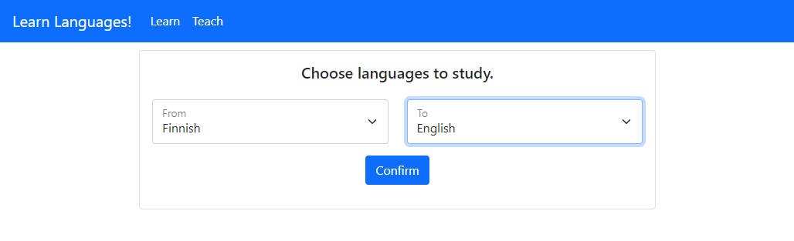
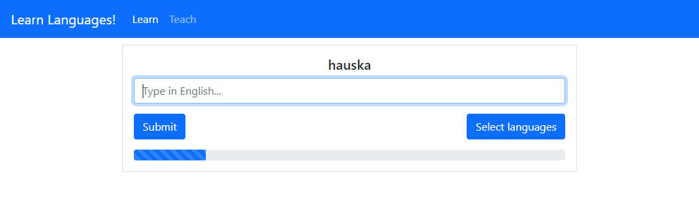
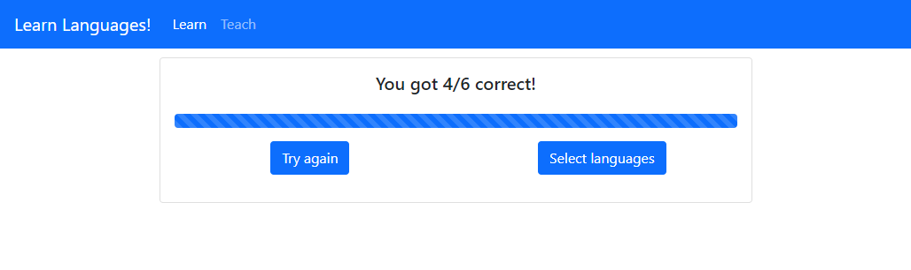
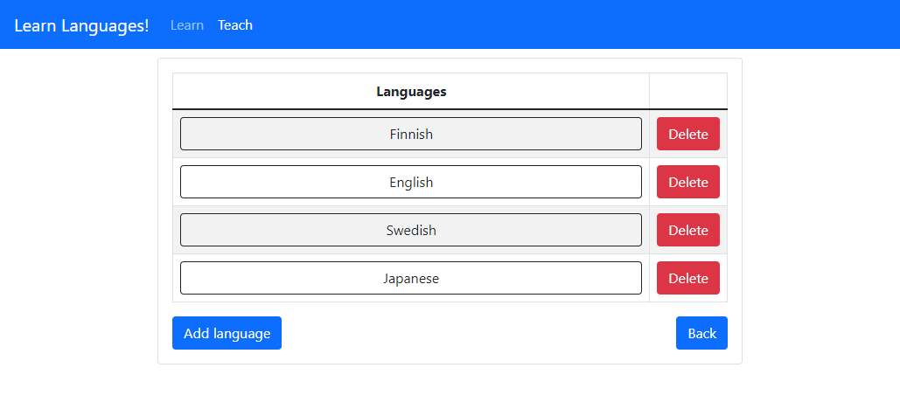
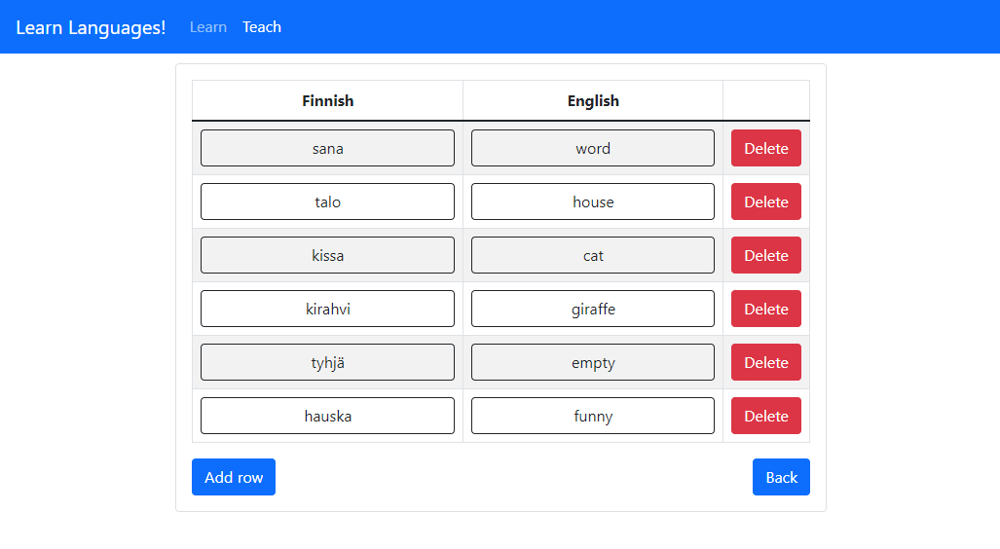

# Learn Languages!
Learn Languages! is a web application that students and teachers can use to learn and teach foreign words. Teachers can submit word pairs that the app will then quiz students on. 

This is a full stack project created for school. The frontend was created with React and backend with Node.js. The UI uses Bootstrap components.

The application is hosted on Heroku here: https://ala-lahti-learn-languages.herokuapp.com/

